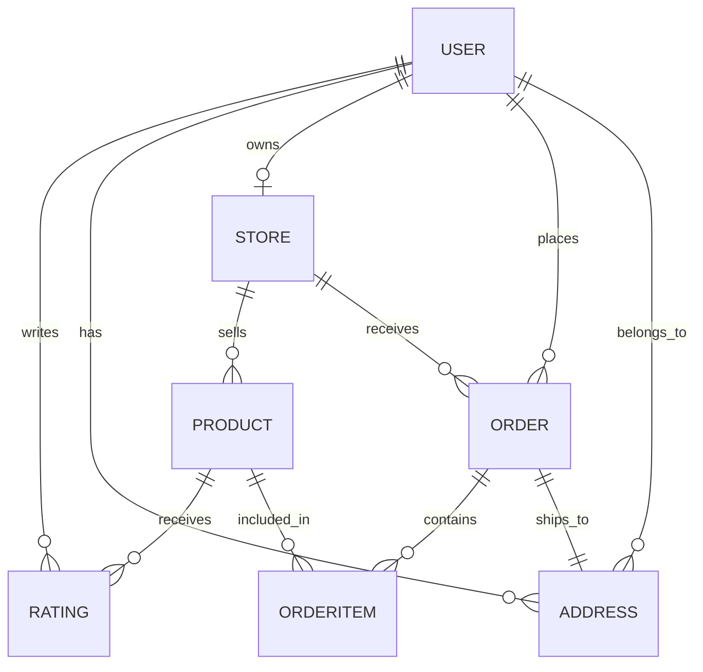

# GoCart - Multi-Tenant E-commerce Platform [1](#0-0) 

A modern, full-stack e-commerce platform built with Next.js that enables users to create their own stores, manage products, and facilitate online transactions. GoCart features a multi-tenant architecture supporting public shopping, store management, and administrative oversight.

## 🚀 Technology Stack

### Frontend
- **Next.js 14** - React framework with App Router
- **React 18** - Component-based UI library
- **Tailwind CSS** - Utility-first CSS framework
- **Lucide React** - Modern icon library [2](#0-1) 

### State Management
- **Redux Toolkit** - Predictable state container
- **React Redux** - Official React bindings for Redux [3](#0-2) 

### Backend & Database
- **Prisma ORM** - Type-safe database client
- **PostgreSQL** - Relational database
- **Server Actions** - Next.js server-side functions [4](#0-3) 

### Authentication & Security
- **Clerk** - Authentication and user management
- **Middleware** - Route protection and authentication [5](#0-4) 

## 🏗️ Architecture Overview

### Application Structure

```mermaid
graph TB
    A["🌐 Public Interface"] --> B["🏪 Store Interface"]
    A --> C["⚙️ Admin Interface"]
    B --> D["📊 Redux Store"]
    C --> D
    A --> D
    D --> E["🗄️ Prisma ORM"]
    E --> F["🐘 PostgreSQL Database"]
    G["🔐 Clerk Auth"] --> A
    G --> B
    G --> C
```



### Core Architecture Components

1. **Multi-Layout System**
   - Public Layout for customer-facing pages
   - Store Layout for seller dashboard
   - Admin Layout for platform administration [6](#0-5) 

2. **Route-based Organization**
   - `(public)/` - Customer shopping experience
   - `store/` - Store owner management
   - `admin/` - Platform administration

3. **Component Architecture**
   - Shared components for common UI elements
   - Feature-specific components for each user type
   - Layout components for different user interfaces

## 📊 Data Schema

### Core Entities

**User Management** [7](#0-6) 

**Product Catalog** [8](#0-7) 

**Order Processing** [9](#0-8) 

**Store Management** [10](#0-9) 

### Database Relationships



## 🔐 Authentication & Middleware

### Authentication System
- **Provider**: Clerk Authentication
- **Features**: Sign-in, sign-up, user management
- **Integration**: Seamless Next.js integration [11](#0-10) 

### Route Protection
- Middleware-based route protection
- Automatic authentication checks
- Protected admin and store routes [12](#0-11) 

## 🎨 User Interfaces

### 1. Public Store Interface

**Homepage Components** [13](#0-12) 

**Navigation & Shopping** [14](#0-13) 

**Key Features:**
- Product browsing and search
- Shopping cart functionality
- User authentication
- Order tracking

### 2. Store Owner Dashboard

**Dashboard Overview** [15](#0-14) 

**Store Management Features:**
- Product management (add, edit, delete)
- Order processing and tracking
- Revenue and analytics dashboard
- Customer reviews and ratings [16](#0-15) 

### 3. Admin Interface

**Admin Dashboard** [17](#0-16) 

**Administrative Features:**
- Store approval and management
- Platform-wide analytics
- Coupon management
- User oversight [18](#0-17) 

## 🔧 Core Components

### State Management (Redux)

**Cart Management** [19](#0-18) 

**Available Reducers:**
- Cart operations (add, remove, clear)
- Product management
- Address handling
- Rating system [20](#0-19) 

### Reusable Components

**Navigation Components:**
- Navbar with cart integration
- Admin navigation
- Store owner navigation

**UI Components:**
- Product cards and details
- Loading states
- Modals and forms
- Rating systems [21](#0-20) 

## ✨ Key Features

### 🛒 E-commerce Core
- **Multi-vendor marketplace** - Multiple stores on one platform
- **Product catalog** - Comprehensive product management
- **Shopping cart** - Redux-powered cart system
- **Order processing** - Complete order lifecycle management
- **Payment integration** - COD and Stripe support

### 🏪 Store Management
- **Store creation** - Easy store setup process
- **Inventory management** - Product CRUD operations
- **Order fulfillment** - Order status tracking
- **Analytics dashboard** - Revenue and performance metrics
- **Review system** - Customer feedback management

### 👑 Platform Administration
- **Store approval** - Admin review of new stores
- **Platform analytics** - Overall marketplace insights
- **Coupon management** - Discount and promotion system
- **User management** - Platform user oversight

### 🔧 Technical Features
- **Responsive design** - Mobile-first approach
- **Type-safe database** - Prisma ORM integration
- **Authentication** - Secure user management
- **State persistence** - Redux state management
- **SEO optimized** - Next.js App Router benefits

## 📁 Project Structure

```
gocart/
├── app/
│   ├── (public)/          # Customer-facing pages
│   ├── admin/             # Admin dashboard
│   ├── store/             # Store owner dashboard
│   └── layout.jsx         # Root layout
├── components/
│   ├── admin/             # Admin-specific components
│   ├── store/             # Store-specific components
│   └── [shared]/          # Shared UI components
├── lib/
│   ├── features/          # Redux slices
│   └── store.js           # Redux store configuration
├── prisma/
│   └── schema.prisma      # Database schema
├── assets/                # Static assets and dummy data
└── middleware.ts          # Authentication middleware
```

## 🚀 Getting Started

### Prerequisites
- Node.js 18+
- PostgreSQL database
- Clerk account for authentication

### Installation

1. **Clone the repository**
   ```bash
   git clone https://github.com/bloodwraith8851/gocart.git
   cd gocart
   ```

2. **Install dependencies**
   ```bash
   npm install
   ```

3. **Set up environment variables**
   ```bash
   cp .env.example .env.local
   ```
   Configure your database URL, Clerk keys, and other environment variables.

4. **Set up the database**
   ```bash
   npx prisma migrate dev
   npx prisma generate
   ```

5. **Run the development server**
   ```bash
   npm run dev
   ```

### Development Workflow

1. **Database Management**
   - Use Prisma Studio: `npx prisma studio`
   - Reset database: `npx prisma migrate reset`

2. **State Management**
   - Redux DevTools integration for debugging
   - Slice-based state organization

3. **Authentication**
   - Clerk dashboard for user management
   - Middleware-based route protection

## 🔧 Configuration

### Environment Variables
```bash
DATABASE_URL="postgresql://..."
DIRECT_URL="postgresql://..."
NEXT_PUBLIC_CLERK_PUBLISHABLE_KEY="pk_..."
CLERK_SECRET_KEY="sk_..."
NEXT_PUBLIC_CURRENCY_SYMBOL="$"
```

### Database Configuration [22](#0-21) 

## 📊 Data Models

### Order Status Flow [23](#0-22) 

### Payment Methods [24](#0-23) 

## 🎯 Features in Detail

### Customer Experience
- Browse products by categories
- Advanced search functionality
- Shopping cart with quantity management
- Secure checkout process
- Order tracking and history
- Product reviews and ratings

### Seller Dashboard
- Store profile management
- Product inventory control
- Order fulfillment tracking
- Sales analytics and reporting
- Customer review management

### Administrative Control
- Store approval workflow
- Platform-wide analytics
- Coupon and promotion management
- User account oversight
- Revenue tracking

## 🛡️ Security Features

- **Authentication**: Clerk-based secure authentication
- **Route Protection**: Middleware-based access control
- **Data Validation**: Prisma schema validation
- **SQL Injection Protection**: Prisma ORM safety
- **CSRF Protection**: Next.js built-in protection

## 📱 Responsive Design

- Mobile-first responsive design
- Tailwind CSS utility classes
- Flexible grid layouts
- Touch-friendly interfaces
- Progressive Web App capabilities

## 🔄 State Management Architecture

### Redux Store Structure [25](#0-24) 

The application uses Redux Toolkit for predictable state management with separate slices for different features, ensuring scalable and maintainable code architecture.

## Notes

This README provides a comprehensive overview of the GoCart e-commerce platform based on the current codebase structure. The project demonstrates modern web development practices with a focus on scalability, maintainability, and user experience. The multi-tenant architecture allows for easy expansion and customization for different business needs.

The platform currently uses dummy data for development purposes but is structured to integrate with real APIs and services for production deployment. The modular component architecture and type-safe database schema make it suitable for enterprise-level e-commerce solutions.

### Citations

**File:** app/layout.jsx (L1-7)
```javascript
import { Outfit } from "next/font/google";
import { Toaster } from "react-hot-toast";
import StoreProvider from "@/app/StoreProvider";
import "./globals.css";
import { ClerkProvider } from "@clerk/nextjs";

const outfit = Outfit({ subsets: ["latin"], weight: ["400", "500", "600"] });
```

**File:** app/layout.jsx (L9-12)
```javascript
export const metadata = {
    title: "GoCart. - Shop smarter",
    description: "GoCart. - Shop smarter",
};
```

**File:** app/layout.jsx (L16-26)
```javascript
        <ClerkProvider>
            <html lang="en">
                <body className={`${outfit.className} antialiased`}>
                    <StoreProvider>
                        <Toaster />
                        {children}
                    </StoreProvider>
                </body>
            </html>
        </ClerkProvider>
    );
```

**File:** lib/store.js (L1-15)
```javascript
import { configureStore } from '@reduxjs/toolkit'
import cartReducer from './features/cart/cartSlice'
import productReducer from './features/product/productSlice'
import addressReducer from './features/address/addressSlice'
import ratingReducer from './features/rating/ratingSlice'

export const makeStore = () => {
    return configureStore({
        reducer: {
            cart: cartReducer,
            product: productReducer,
            address: addressReducer,
            rating: ratingReducer,
        },
    })
```

**File:** prisma/schema.prisma (L1-10)
```text
generator client {
    provider        = "prisma-client-js"
    previewFeatures = ["driverAdapters"]
}

datasource db {
    provider  = "postgresql"
    url       = env("DATABASE_URL")
    directUrl = env("DIRECT_URL")
}
```

**File:** prisma/schema.prisma (L13-25)
```text
model User {
    id    String @id
    name  String
    email String
    image String
    cart  Json   @default("{}")

    // Relations
    ratings     Rating[]
    Address     Address[]
    store       Store?
    buyerOrders Order[]   @relation("BuyerRelation")
}
```

**File:** prisma/schema.prisma (L28-45)
```text
model Product {
    id          String   @id @default(cuid())
    name        String
    description String
    mrp         Float
    price       Float
    images      String[]
    category    String
    inStock     Boolean  @default(true)
    storeId     String
    createdAt   DateTime @default(now())
    updatedAt   DateTime @updatedAt

    // Relations
    store      Store       @relation(fields: [storeId], references: [id], onDelete: Cascade)
    orderItems OrderItem[]
    rating     Rating[]
}
```

**File:** prisma/schema.prisma (L47-52)
```text
enum OrderStatus {
    ORDER_PLACED
    PROCESSING
    SHIPPED
    DELIVERED
}
```

**File:** prisma/schema.prisma (L54-57)
```text
enum PaymentMethod {
    COD
    STRIPE
}
```

**File:** prisma/schema.prisma (L60-79)
```text
model Order {
    id            String        @id @default(cuid())
    total         Float
    status        OrderStatus   @default(ORDER_PLACED)
    userId        String
    storeId       String
    addressId     String
    isPaid        Boolean       @default(false)
    paymentMethod PaymentMethod
    createdAt     DateTime      @default(now())
    updatedAt     DateTime      @updatedAt
    isCouponUsed  Boolean       @default(false)
    coupon        Json          @default("{}")
    orderItems    OrderItem[]

    // Relations
    user    User    @relation("BuyerRelation", fields: [userId], references: [id])
    store   Store   @relation(fields: [storeId], references: [id])
    address Address @relation(fields: [addressId], references: [id])
}
```

**File:** prisma/schema.prisma (L145-162)
```text
model Store {
    id          String   @id @default(cuid())
    userId      String   @unique
    name        String
    description String
    username    String   @unique
    address     String
    status      String   @default("pending")
    isActive    Boolean  @default(false)
    logo        String
    email       String
    contact     String
    createdAt   DateTime @default(now())
    updatedAt   DateTime @updatedAt

    Product Product[]
    Order   Order[]
    user    User      @relation(fields: [userId], references: [id])
```

**File:** middleware.ts (L1-12)
```typescript
import { clerkMiddleware } from '@clerk/nextjs/server';

export default clerkMiddleware();

export const config = {
  matcher: [
    // Skip Next.js internals and all static files, unless found in search params
    '/((?!_next|[^?]*\\.(?:html?|css|js(?!on)|jpe?g|webp|png|gif|svg|ttf|woff2?|ico|csv|docx?|xlsx?|zip|webmanifest)).*)',
    // Always run for API routes
    '/(api|trpc)(.*)',
  ],
};
```

**File:** app/(public)/layout.jsx (L6-16)
```javascript
export default function PublicLayout({ children }) {

    return (
        <>
            <Banner />
            <Navbar />
            {children}
            <Footer />
        </>
    );
}
```

**File:** app/(public)/page.jsx (L8-18)
```javascript
export default function Home() {
    return (
        <div>
            <Hero />
            <LatestProducts />
            <BestSelling />
            <OurSpecs />
            <Newsletter />
        </div>
    );
}
```

**File:** components/Navbar.jsx (L24-52)
```javascript
    return (
        <nav className="relative bg-white">
            <div className="mx-6">
                <div className="flex items-center justify-between max-w-7xl mx-auto py-4  transition-all">

                    <Link href="/" className="relative text-4xl font-semibold text-slate-700">
                        <span className="text-green-600">go</span>cart<span className="text-green-600 text-5xl leading-0">.</span>
                        <p className="absolute text-xs font-semibold -top-1 -right-8 px-3 p-0.5 rounded-full flex items-center gap-2 text-white bg-green-500">
                            plus
                        </p>
                    </Link>

                    {/* Desktop Menu */}
                    <div className="hidden sm:flex items-center gap-4 lg:gap-8 text-slate-600">
                        <Link href="/">Home</Link>
                        <Link href="/shop">Shop</Link>
                        <Link href="/">About</Link>
                        <Link href="/">Contact</Link>

                        <form onSubmit={handleSearch} className="hidden xl:flex items-center w-xs text-sm gap-2 bg-slate-100 px-4 py-3 rounded-full">
                            <Search size={18} className="text-slate-600" />
                            <input className="w-full bg-transparent outline-none placeholder-slate-600" type="text" placeholder="Search products" value={search} onChange={(e) => setSearch(e.target.value)} required />
                        </form>

                        <Link href="/cart" className="relative flex items-center gap-2 text-slate-600">
                            <ShoppingCart size={18} />
                            Cart
                            <button className="absolute -top-1 left-3 text-[8px] text-white bg-slate-600 size-3.5 rounded-full">{cartCount}</button>
                        </Link>
```

**File:** app/store/page.jsx (L23-28)
```javascript
    const dashboardCardsData = [
        { title: 'Total Products', value: dashboardData.totalProducts, icon: ShoppingBasketIcon },
        { title: 'Total Earnings', value: currency + dashboardData.totalEarnings, icon: CircleDollarSignIcon },
        { title: 'Total Orders', value: dashboardData.totalOrders, icon: TagsIcon },
        { title: 'Total Ratings', value: dashboardData.ratings.length, icon: StarIcon },
    ]
```

**File:** components/store/StoreLayout.jsx (L29-39)
```javascript
    ) : isSeller ? (
        <div className="flex flex-col h-screen">
            <SellerNavbar />
            <div className="flex flex-1 items-start h-full overflow-y-scroll no-scrollbar">
                <SellerSidebar storeInfo={storeInfo} />
                <div className="flex-1 h-full p-5 lg:pl-12 lg:pt-12 overflow-y-scroll">
                    {children}
                </div>
            </div>
        </div>
    ) : (
```

**File:** app/admin/page.jsx (L21-26)
```javascript
    const dashboardCardsData = [
        { title: 'Total Products', value: dashboardData.products, icon: ShoppingBasketIcon },
        { title: 'Total Revenue', value: currency + dashboardData.revenue, icon: CircleDollarSignIcon },
        { title: 'Total Orders', value: dashboardData.orders, icon: TagsIcon },
        { title: 'Total Stores', value: dashboardData.stores, icon: StoreIcon },
    ]
```

**File:** components/admin/AdminLayout.jsx (L26-34)
```javascript
        <div className="flex flex-col h-screen">
            <AdminNavbar />
            <div className="flex flex-1 items-start h-full overflow-y-scroll no-scrollbar">
                <AdminSidebar />
                <div className="flex-1 h-full p-5 lg:pl-12 lg:pt-12 overflow-y-scroll">
                    {children}
                </div>
            </div>
        </div>
```

**File:** lib/features/cart/cartSlice.js (L3-15)
```javascript
const cartSlice = createSlice({
    name: 'cart',
    initialState: {
        total: 0,
        cartItems: {},
    },
    reducers: {
        addToCart: (state, action) => {
            const { productId } = action.payload
            if (state.cartItems[productId]) {
                state.cartItems[productId]++
            } else {
                state.cartItems[productId] = 1
```

**File:** assets/assets.js (L31-31)
```javascript
export const categories = ["Headphones", "Speakers", "Watch", "Earbuds", "Mouse", "Decoration"];
```

**File:** app/StoreProvider.js (L6-13)
```javascript
export default function StoreProvider({ children }) {
  const storeRef = useRef(undefined)
  if (!storeRef.current) {
    // Create the store instance the first time this renders
    storeRef.current = makeStore()
  }

  return <Provider store={storeRef.current}>{children}</Provider>
```
